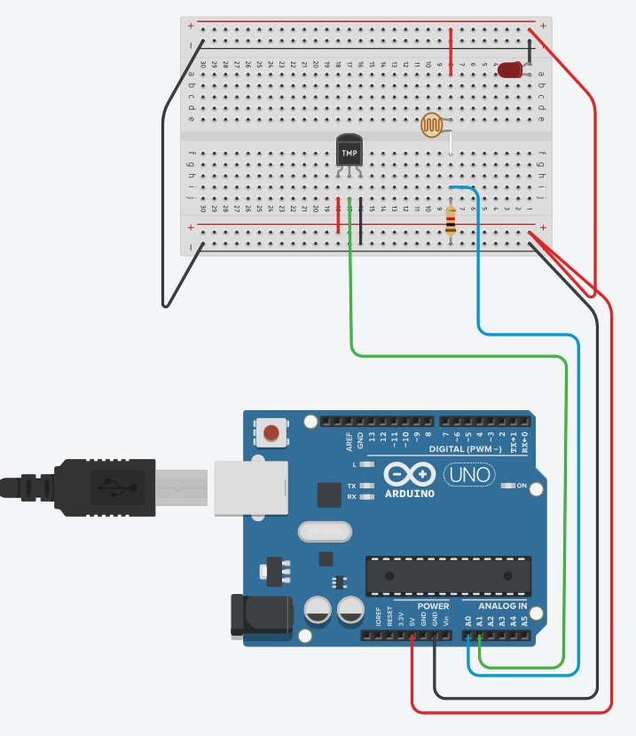
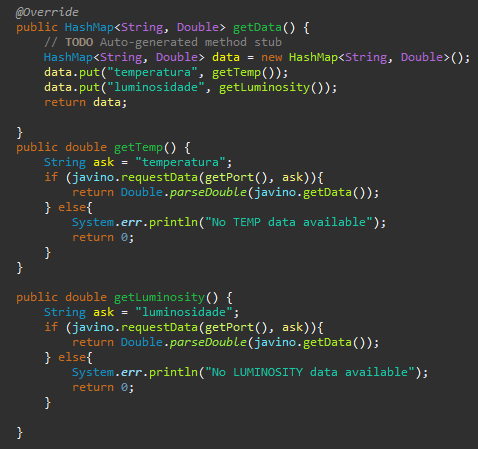

# Computação Ubíqua - JAVINO
## Atividade
Desenvolver um projeto com Arduino, medir temperatura e luminosidade. Coletar através da interface serial (Usando o Javino) os valores e plotar um gráfico dos dados.

O que deve ser entregue:
Um relatório descrevendo os procedimentos e tecnologias utilizadas para a realização do experimento, no padrão de tutorial. O código deve ser colocado em um repositório público no github, e o relatório pode ser postado como arquivo README.md na raiz do repositório.

## Requisitos
Esse projeto foi desenvolvido e testado em um abiente composto por JavaEE 7 + Tomcat 8 + Python 3.4 e Arduino UNO.

A biblioteca [JAVINO](https://sourceforge.net/projects/javino/) foi usada para interfacear o Java com o Arduino via Python.

## Projeto
Como sensor foi usado uma placa Arduino UNO e um LDR como sensor de luminosidade e um TMP36 como sensor de temperatura.

O arduino fica "ouvindo" se existe alguma solicitação.

Enquanto o Java envia o pedido da informação do sensor desejado.

## Testando

1. Instalar os drivers e IDE do Arduino;

2. Conectar o Arduino no PC;

3. Compilar e enviar o programa para o Arduino, anotando a porta em que ele está conectado;

4. Ligar o serviço do Tomcat 7;

5. Fazer o upload do arquivo WAR;

6. Ao abir o endereço será questionado em qual porta o Arduino se encontra (uma porta COM no caso do Windows);

7. Por padrão o Arduino captura dados de 5 em 5 minutos;

8. Verificar nas páginas dos sensores os dados atualizados;

## Referências
* LAZARIN, N M, e PANTOJA C E. 2015. “A Robotic-agent Platform For Embedding Software Agents using Raspberry Pi and Arduino Boards”. Anais do IX Workshop-Escola de Sistemas de Agentes, seus Ambientes e Aplicações – IX WESAAC.
